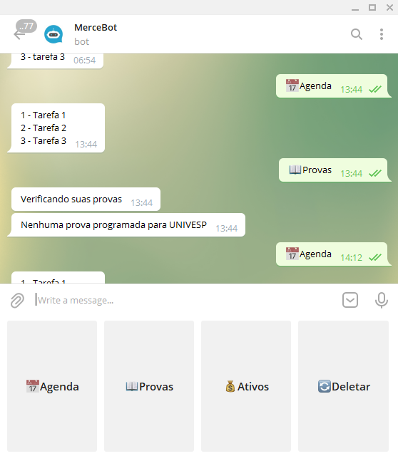

<h1 align="center">
  
</h1>

  <a href="#-tecnologias">Tecnologias</a>&nbsp;&nbsp;&nbsp;|&nbsp;&nbsp;&nbsp;
  <a href="#-projeto">Projeto</a>&nbsp;&nbsp;&nbsp;|&nbsp;&nbsp;&nbsp;
  <a href="#-layout">Layout</a>&nbsp;&nbsp;&nbsp;|&nbsp;&nbsp;&nbsp;
  <a href="#memo-licença">Licença</a>

 

  

 

  

## 🚀 Tecnologias

Esse projeto foi desenvolvido com as seguintes tecnologias:

- Python
- Selenium
- SQLite

## 💻 Projeto

O MeAgenda é uma aplicação de agenda, onde utilizo para gravar minha lista de tarefas, além de poder programar o horário que quero ser lembrado. Utilizo também para consultar minhas provas das faculdades e valores dos ativos que tenho em mercado 💰

## :memo: Licença

Esse projeto está sob a licença MIT. Veja o arquivo [LICENSE](Agenda/.github/LICENSE.md) para mais detalhes.

---

Feito com ♥ by Rocketseat :wave: [Participe da nossa comunidade!](https://discordapp.com/invite/gCRAFhc)
